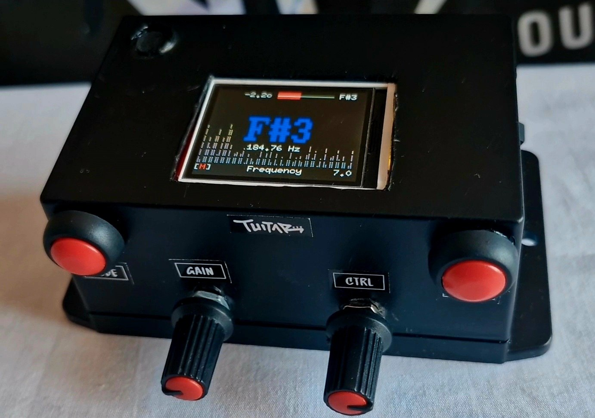

<p align="center">
    </a>
    </a>
    <br>
    <b>"Learning how to play guitar with a TUI - hence <em>Tuitar</em>."</b>
    <br>
    <b> [ </b>Written in Rust &amp; built with <a href="https://ratatui.rs">Ratatui</a></em> ] </b>
    <br>
    <br>
    <a href="https://github.com/orhun/tuitar/releases">
        
    </a>
    <a href="https://crates.io/crates/tuitar/">
        
    </a>
    <a href="https://github.com/orhun/tuitar/actions?query=workflow%3A%22Continuous+Integration%22">
        
    </a>
    <a href="https://github.com/orhun/tuitar/blob/master/LICENSE">
        
    </a>
    <a href="https://github.com/ratatui/ratatui">
        
    </a>
</p>

---


<p align="center">



**Tuitar** is a terminal-based guitar training tool that runs standalone on ESP32 hardware. See the [features](#features).

Available as a DIY kit, see the [firmware](./firmware/README.md) and [hardware](./hardware/README.md) sections for more details.

</p>

> [!NOTE]  
> **Tuitar** is currently in prototype stage but you can still try it out and contribute to the project.
>
> The plan is to feature it on [CrowdSupply](https://crowdsupply.com) once the firmware and hardware are stable. Let me know if you are interested in supporting the project or have [any feedback](https://github.com/orhun/tuitar/issues)!
>
> All of this is built on livestream as a part of a series called [Becoming a Musician](https://www.youtube.com/playlist?list=PLxqHy2Zr5TiUiLYsNbFF8ACf_Er_7MgP-) (100+ hours of content!)

## Features

### Tuning

**Tuitar** offers real-time visualizations from [an input source](#input-modes) which can be used for tuning your guitar or other instruments.


The **frequency** graph above shows the detected frequency of the input sound. When a fundamental frequency is detected, the closest musical note is being displayed with the respective [cents](<https://en.wikipedia.org/wiki/Cent_(music)>) with a bar at the top.

Also, the dots next to the displayed note indicate the distance to the perfect note in cents (left/red for flat, right/green for sharp).

When the displayed note is green and the bar is centered, it means that the input sound is perfectly in tune with that note.

### Fretboard Tracking

**Tuitar** can track the notes you play on your guitar in real-time and display them on a virtual fretboard.

The default (**live**) mode shows the currently pressed strings and frets:


One fun thing you can do is to switch to **random** mode which is a small game where you get points by playing the correct notes shown on the screen. There is a timer and a score counter at the top.


The **song** mode is also available which shows the notes of a pre-loaded song. It's useful for learning riffs, solos or any melody.


> [!NOTE]  
> You can load a song onto the device by placing the MIDI file (_.mid) or Guitar Pro file (_.gp3, _.gp4, _.gp5) into the `tuitar-core/songs` directory and re-flashing the [firmware](./firmware/README.md). This will be made more user-friendly in the future.

The **scale** mode also helps with learning scales.


The available scales are:

- Major and Minor
- Pentatonic (Major and Minor)
- Blues
- Mixolydian
- Dorian
- Lydian

You can also press the mode and menu buttons to toggle the root note. (See [controls](#controls) for more information.)

In every fretboard mode, turning the control knob will change the focused region of the fretboard. This is useful for practicing scales or riffs in different positions.
[Unison](https://en.wikipedia.org/wiki/Unison) is also supported, so you can play the same note on different strings and it will be highlighted on the fretboard.

### Signal Analysis

If you need additional information about the input signal, you can use the [waveform](#waveform) and [spectrum](#spectrum) graphs.

#### Waveform


Shows the raw audio signal over time. You can change the focused region in the chart by turning the knob. It is especially useful for debugging the input since the y-axis is simply shows a voltage from 0 to 3.3V.

#### Spectrum


Shows the frequency spectrum of the input signal. Especially useful for dB measurements and debugging the input. The x-axis is frequency in Hz while the y-axis is the amplitude in dB.

## Input modes

**Tuitar** currently supports **2** input modes:

1. Microphone input
2. Jack input (6.35mm)

Press the **mode** button to switch between the input modes. The current mode is displayed at the left bottom corner of the screen. (`[M]` or `[J]`)

## FPS

The current FPS is being shown on the right bottom corner of the screen.

## Controls

**Tuitar** has a simple control scheme with **2 buttons** and **2 knobs**.
The controls are context-sensitive, meaning they change their function based on the current tab.

### Global

| Control   | Action | Function                             |
| --------- | ------ | ------------------------------------ |
| Gain knob | Turn   | Adjust input gain (jack sensitivity) |

### Fretboard

| Control     | Action      | Function                                                 |
| ----------- | ----------- | -------------------------------------------------------- |
| Mode button | Short press | Switch fretboard mode (Live ↔ Random ↔ Scales ↔ Song) |
| Mode button | Long press  | Switch input mode (Mic ↔ Jack)                          |
| Menu button | Short press | Go to the next tab                                       |
| Menu button | Long press  | Change scale                                             |
| Mode + Menu | Short press | Toggle root note or song                                 |
| Ctrl knob   | Turn        | Scroll fretboard                                         |

## Frequency/Spectrum/Waveform

| Control     | Action      | Function                        |
| ----------- | ----------- | ------------------------------- |
| Mode button | Short press | Switch input mode (Mic ↔ Jack) |
| Menu button | Short press | Go to the next tab              |
| Ctrl knob   | Turn        | Scroll frequency chart          |

## Terminal

**Tuitar** also runs as a terminal application.

To install:

```sh
cargo install tuitar --locked
```

Run:

```sh
tuitar
```

It only supports pitch detection and fretboard tracking for now, but you can use it to practice your guitar skills without the hardware.

## Architecture

The codebase consists of the following crates:

- [`tuitar-core`](./tuitar-core/README.md): The core logic and UI of **Tuitar**.
- [`firmware`](./firmware/README.md): The firmware for the ESP32 hardware.
- [`hardware`](./hardware/README.md): The hardware design files for the **Tuitar** kit.
- [`tuitar`](./tuitar/README.md): The terminal application for **Tuitar**.
- [`ratatui-fretboard`](./ratatui-fretboard/README.md): A crate for rendering fretboards in terminal applications using Ratatui.

The dependency relationship is as follows:

```text
tuitar-core
 └── ratatui-fretboard

firmware
 ├── tuitar-core
 └── ratatui-fretboard

tuitar
 ├── tuitar-core
 └── ratatui-fretboard

hardware (no code deps)
```

## Old Demos

Here are some demos from the development phase.

**Tuitar** running on ESP32 T-Display:

https://github.com/user-attachments/assets/1922a316-57ff-4f3d-92eb-5ba5ff0dfdd8

With jack input:

https://github.com/user-attachments/assets/cdbdc811-790d-4dac-8dc4-51d49589d3c0

## License & Contributions

This project can be used under the terms of the [Apache-2.0](./LICENSE-APACHE) or [MIT](./LICENSE-MIT) licenses.
Contributions to this project, unless noted otherwise, are automatically licensed under the terms of both of those licenses.

🦀 ノ( º \_ º ノ) - _respect crables!_

Feel free to open issues or PRs for improvements, bug fixes, or ideas!

## Copyright

Copyright © 2025, [Orhun Parmaksız](mailto:orhunparmaksiz@gmail.com)
