# Tuitar Hardware v0

This directory contains the hardware design files for Tuitar.

- [PCB design](./pcb.json)
- [Schematic design](./schematics.json)

They are designed with the [EasyEDA](https://easyeda.com/) software, which you can use online or download the desktop client.

For the assembly instructions, see [ASSEMBLY.md](./ASSEMBLY.md).

## Schematics

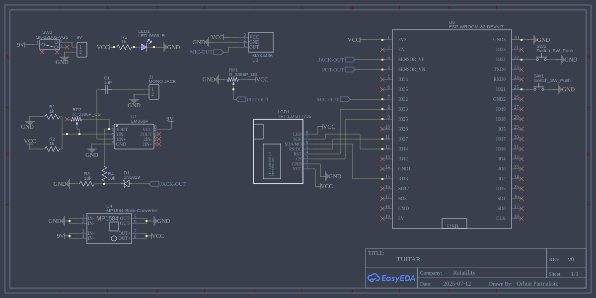

## PCB

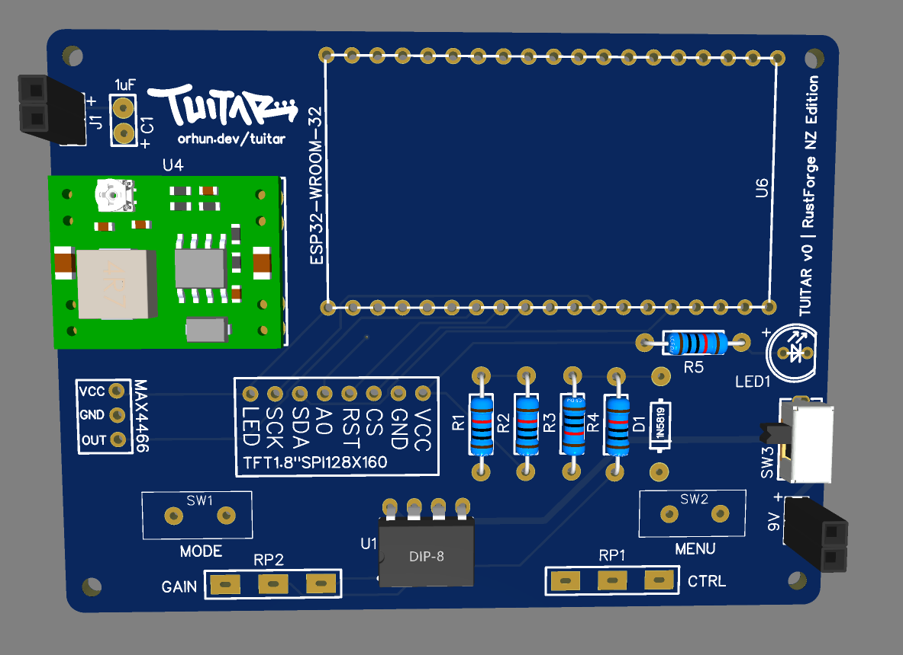

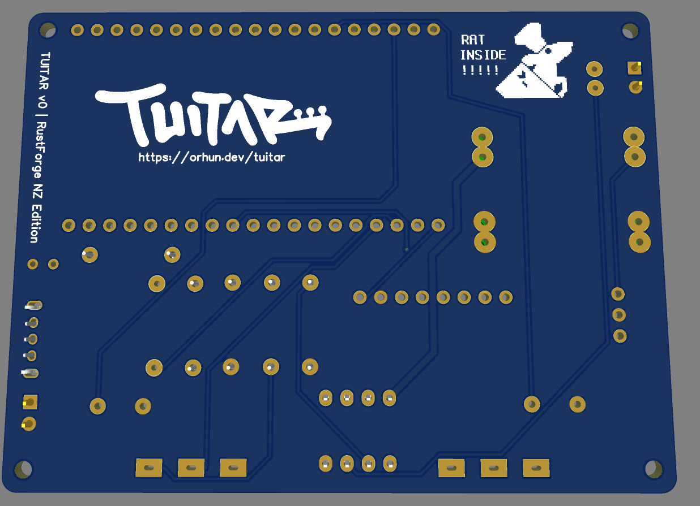

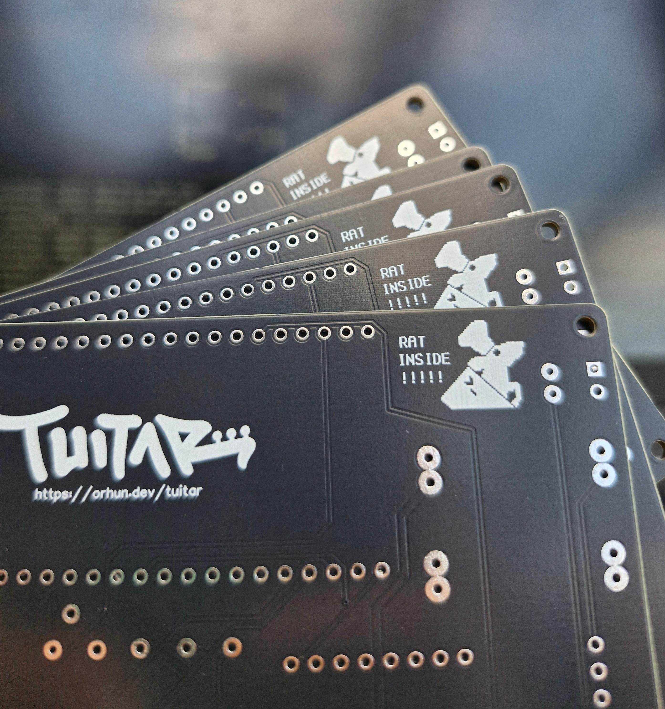

## PCB (assembled)

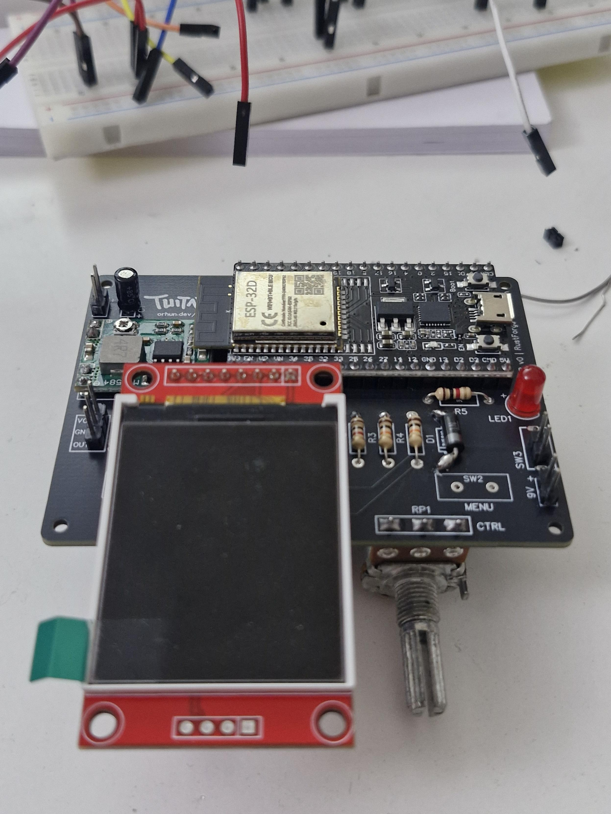

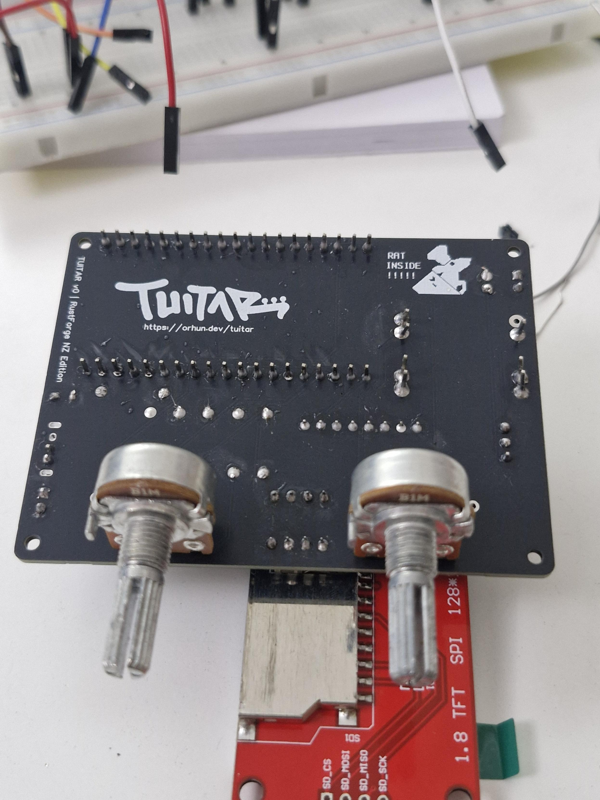

## Case

The dimensions are 100mm x 65mm x 50mm (L x W x H)

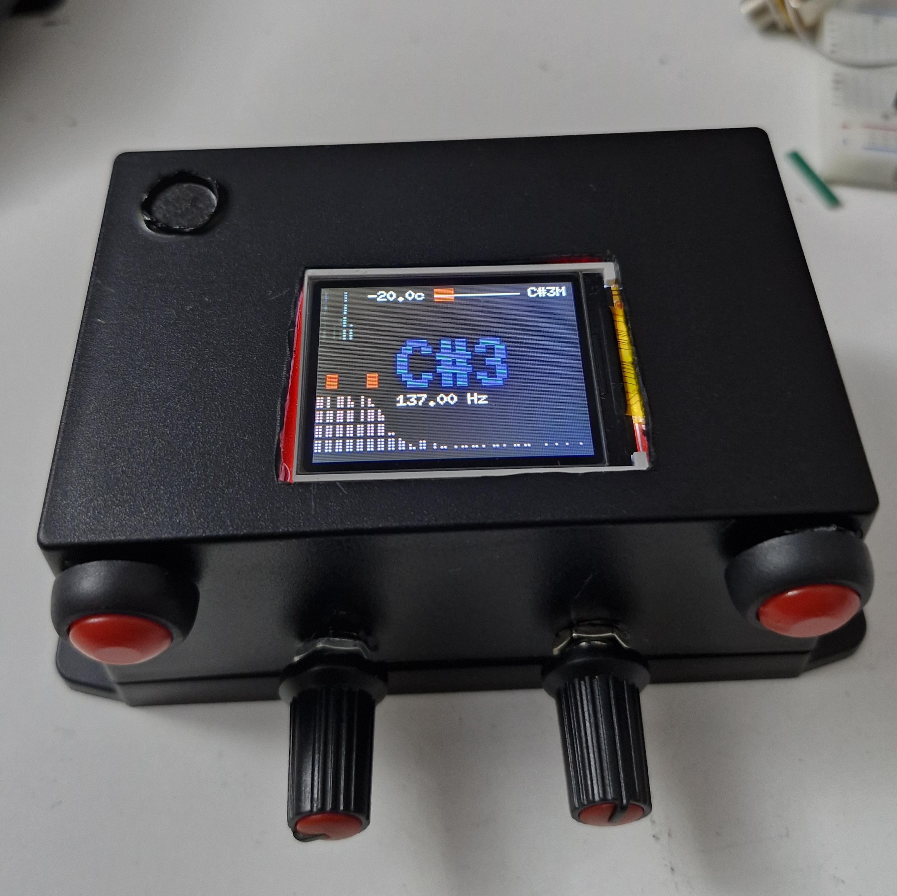

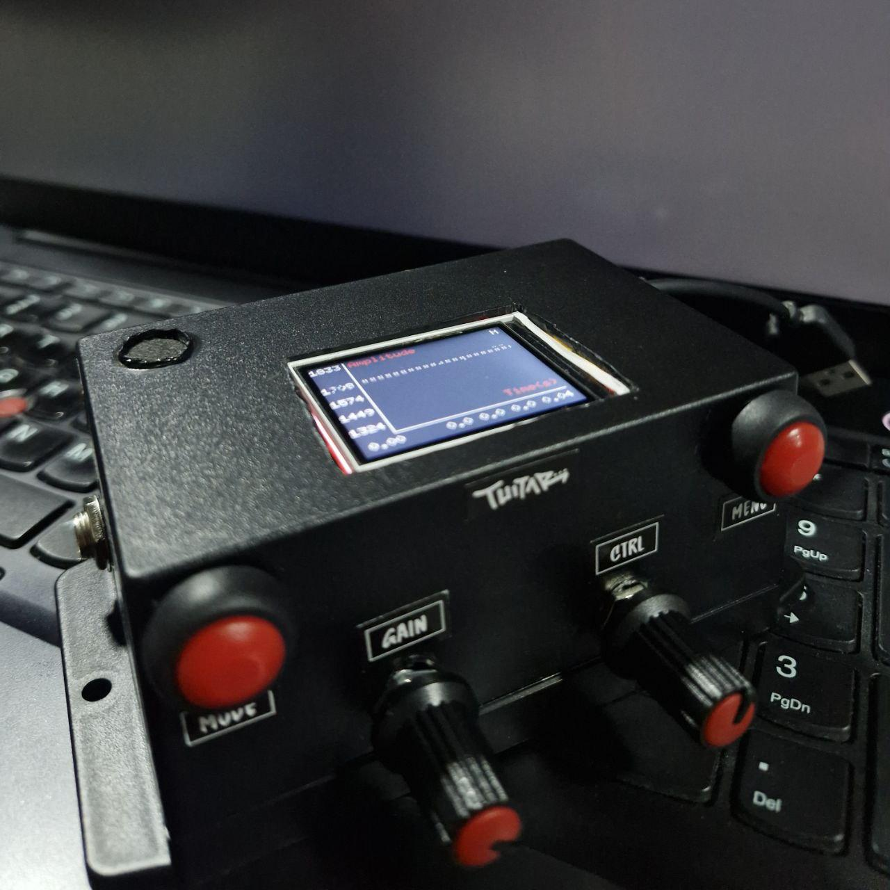

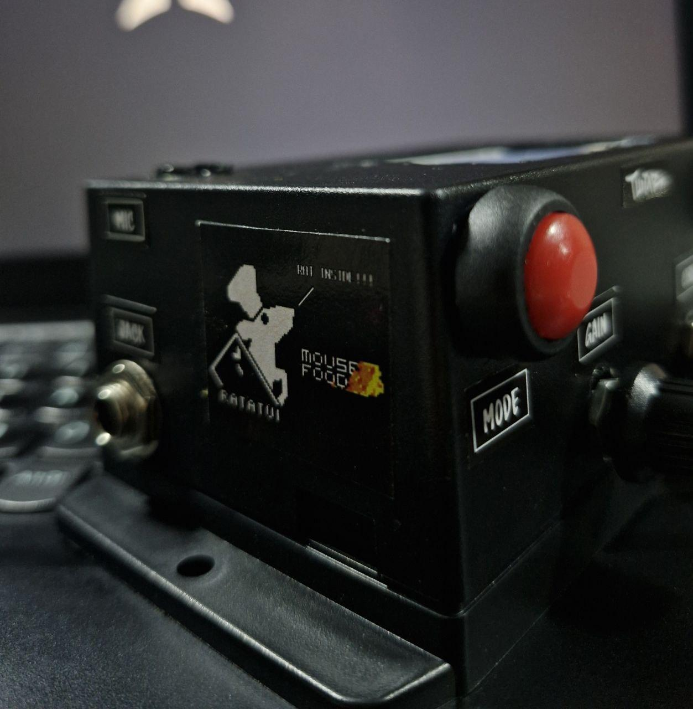

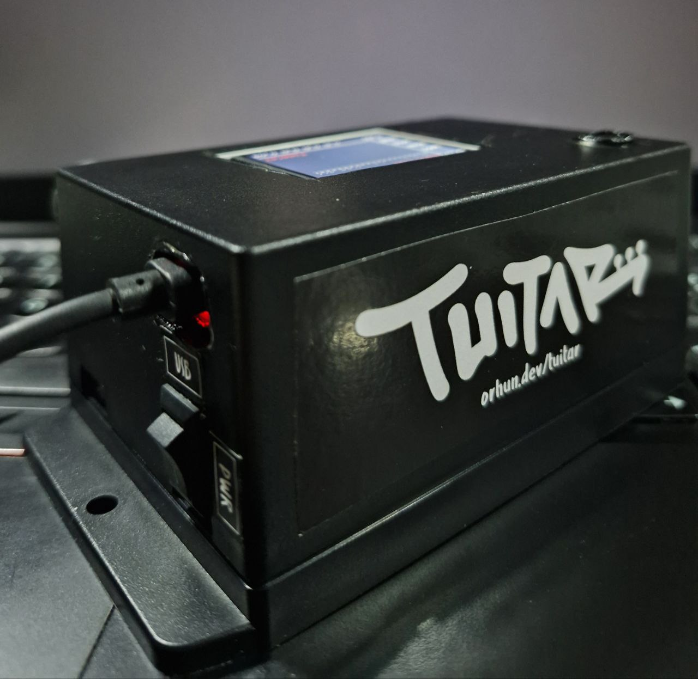

## Case Labels

The dimensions are 99mm x 64mm (W x H).

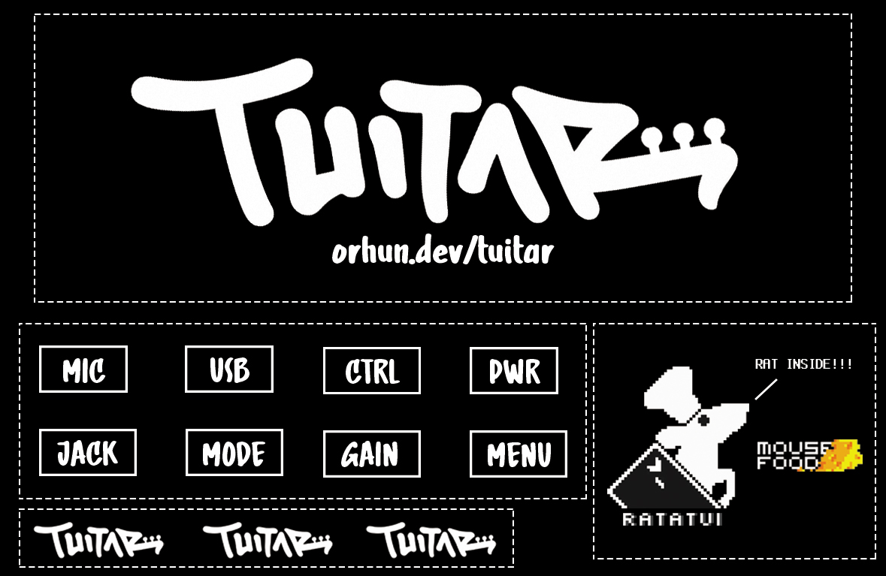
