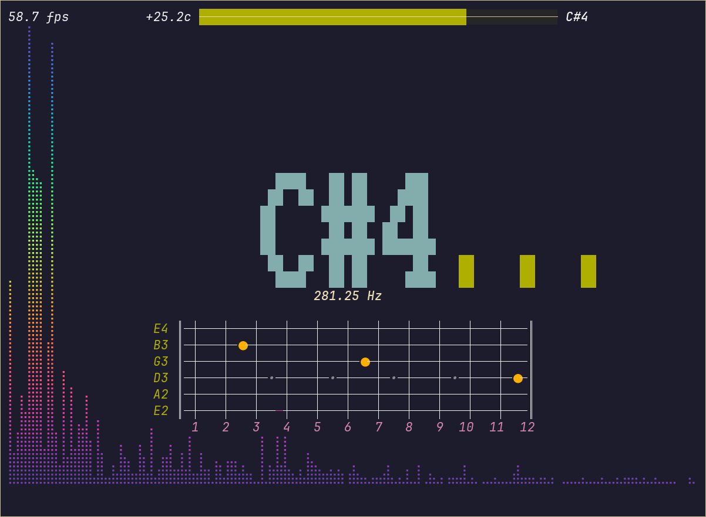

# Tuitar

Terminal user interface for [Tuitar](https://github.com/orhun/tuitar).

It can be used for:

- Pitch detection from the microphone input.
- Tuning the guitar.
- The real-time visualization of the fretboard.

**Tuitar** is originally designed to run on the ESP32 hardware, but this application tries to implement the same features as closely as possible.

See the [main repository](https://github.com/orhun/tuitar) for more information about the project.
